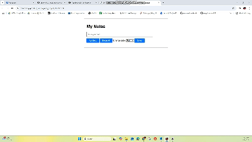

# Simple Note Project 📝

## Project Overview:
The **Simple Note Project** is a basic note-taking web application built with **HTML**, **CSS**, and **JavaScript**. This project demonstrates how to manipulate the Document Object Model (DOM) by adding, deleting, and changing the text color of notes.

### Features:
- **Add Note**: Create new notes and display them on the page.
- **Delete Note**: Remove any note from the list.
- **Change Text Color**: Change the color of the text in any note.

### Tools and Technologies:
- **HTML**: For structuring the note-taking app.
- **CSS**: For styling the application and making it visually appealing.
- **JavaScript**: Used to add interactivity, such as adding and deleting notes, and changing text colors.
- **DOM Manipulation**: Manipulating the page content in real-time through JavaScript.

## How to Use:
1. **Add a Note**: Type your note in the input box and click the "Add Note" button to add it to the list.
2. **Delete a Note**: Click the "Delete" button next to any note to remove it.
3. **Change Text Color**: Click the "Change Color" button to change the text color of any note.

## Installation:
  Clone the repository:
   ```bash
   git clone https://github.com/your-username/simple-note-project.git
  ```
## Preview:
  You can try it: [Here](https://phamchivy.github.io/Simple_note_project/index.html)

 

